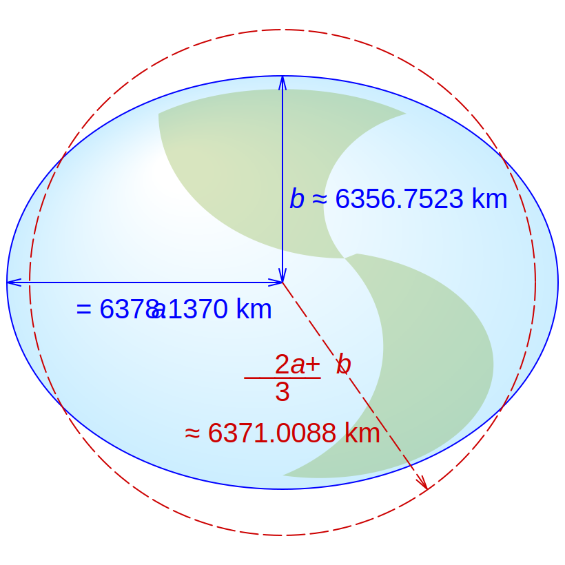

# Overview

<p class="badges">
  
</p>

The `@math.gl/geospatial` module provides support for ellipsoidal math, focusing on geospatial use cases.

It provides classes and utilities to facilitate working with ellipsoidal geospatial coordinate systems and projections used with computer maps, primarily [WGS84](https://en.wikipedia.org/wiki/World_Geodetic_System) (World Geodetic System) coordinates.



<center>WGS84: The 1984 World Geodetic System Ellipsoid. <br/>
Attribution: From <a href="https://en.wikipedia.org/wiki/World_Geodetic_System#/media/File:WGS84_mean_Earth_radius.svg">wikipedia</a>, Creative Commons 4.0.</center>

## Classes

| Class             | Description                                                     |
| ----------------- | --------------------------------------------------------------- |
| `Ellipsoid`       | Implements ellipsoid                                            |
| `Ellipsoid.WSG84` | An `Ellipsoid` instance initialized with Earth radii per WGS84. |

## Usage Examples

A major use of this library is to convert between "cartesian" (`x`, `y`, `z`) and "cartographic" (`longitude`, `latitude`, `height`) representations of WSG84 coordinates. The `Ellipsoid` class implements these calculations.

## Usage

Determine the Cartesian representation of a Cartographic position on a WGS84 ellipsoid.

```js
import {toRadians} from '@math.gl/core';
import {Ellipsoid} from '@math.gl/geospatial';
const cartographicPosition = [toRadians(21), toRadians(78), 5000];
const cartesianPosition = Ellipsoid.WGS84.cartographicToCartesian(cartographicPosition);
```

Determine the Cartographic representation of a Cartesian position on a WGS84 ellipsoid.

```js
import {Ellipsoid} from '@math.gl/geospatial';
const cartesianPosition = [17832.12, 83234.52, 952313.73];
const cartographicPosition = Ellipsoid.WGS84.cartesianToCartographic(cartesianPosition);
```

Get the transform from local east-north-up at cartographic (0.0, 0.0) to Earth's fixed frame.

```js
import {Ellipsoid} from '@math.gl/geospatial';
const transformMatrix = Ellipsoid.WGS84.eastNorthUpToFixedFrame([0, 0, 0]);
```

## Framework Independence

Like all non-core math.gl modules, this module can be used independently of core math.gl classes.

- Any input or result vectors can be supplied as JavaScript `Array` instances of length 3, or objects with `x`, `y`, `z` elements.

## History

This library was initially created as part of a bigger collaboration between the vis.gl and Cesium teams to provide framework-independent, portable support for the 3D Tiles specification, however it has been designed to provide generic support for WGS84 and ellipsoidal math.

## Attribution

This code is a fork of selected classes in the [Cesium](https://github.com/AnalyticalGraphicsInc/cesium) code base, under the Apache 2 License.
